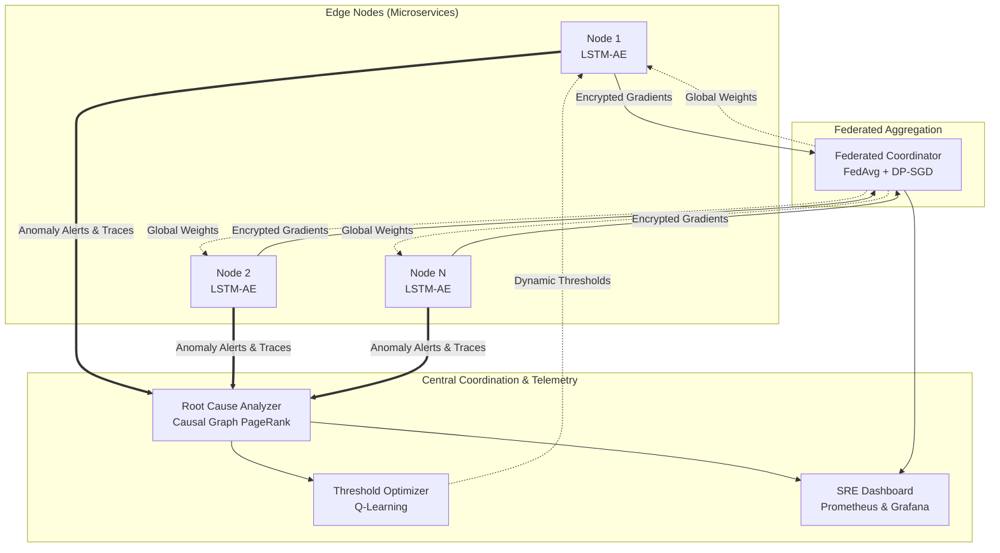

# Federated Anomaly Detection Framework

**Full Thesis Manuscript**: The complete, final written thesis manuscript (PDF and LaTeX source code) is available in the [`./docs/thesis`](./docs/thesis) directory.

## Table of Contents
1. [Abstract](#1-abstract)
2. [Key Contributions](#2-key-contributions)
3. [System Architecture](#3-system-architecture)
4. [Theoretical Foundation](#4-theoretical-foundation)
5. [Empirical Results](#5-empirical-results)
6. [Technology Stack](#6-technology-stack)
7. [Running the Demonstration](#7-running-the-demonstration)
8. [Citation](#8-citation)

## 1. Abstract
Modern distributed systems, composed of microservices and heterogeneous components, are increasingly complex and prone to performance anomalies that can compromise reliability and service quality. Traditional centralized monitoring systems struggle with massive bandwidth bottlenecks and severe data privacy risks. 

This framework proposes an end-to-end Site Reliability Engineering (SRE) architecture integrating real-time edge detection via Long Short-Term Memory Autoencoders (LSTM-AE), federated learning (FedAvg) for collaborative model training without centralizing raw telemetry, causal graph-based root cause analysis (RCA), and adaptive Q-learning thresholding. By combining localized anomaly detection at the edge with global model aggregation, the framework enhances detection accuracy while preserving data privacy through Differential Privacy (DP-SGD).

## 2. Key Contributions
* **Decentralized Inference**: Pushed sub-second anomaly detection directly to edge nodes, eliminating the need to transmit high-resolution raw telemetry to a central server.
* **Privacy-Preserving Aggregation**: Implemented Federated Learning secured by Differential Privacy (DP-SGD), achieving global model consensus exclusively through encrypted gradient sharing.
* **Automated Root Cause Tracing**: Developed a deterministic PageRank-based causal analyzer that traverses dynamic microservice dependency graphs to isolate the origin of cascading failures.
* **Adaptive Alerting**: Replaced static SLO thresholds with a Reinforcement Learning (Q-learning) agent to dynamically balance precision and recall, dramatically reducing false positive alerts in volatile environments.

## 3. System Architecture



## 4. Theoretical Foundation
The framework relies on the integration of the following domains:
* **Time-Series Forecasting**: Unsupervised reconstruction of 38-dimensional telemetry using an LSTM-Autoencoder.
* **Federated Optimization**: The global model objective is minimized using the `FedAvg` algorithm over $K$ clients:
  $$ w_{t+1} = \sum_{k=1}^{K} \frac{n_k}{n} w_{t+1}^k $$
* **Differential Privacy**: Client updates are bounded by an $L_2$ clipping norm $C$ and obscured via Gaussian noise $\mathcal{N}(0, \sigma^2 C^2)$.
* **Causal Tracing**: Utilizing Breadth-First Search (BFS) and PageRank over directed acyclic dependency graphs to calculate impact probability scores.

## 5. Empirical Results
Extensive benchmarking was performed across the **Server Machine Dataset (SMD)**, **Train-Ticket**, and **Alibaba Cluster Traces**.

| Metric | Result | Context |
|---|---|---|
| **Best Detection Fidelity** | **F1: 0.839**, AUC-ROC: **0.950** | Config C ($h=128$, $L=2$). The F1-score is highly competitive with centralized SOTA architectures such as OmniAnomaly (F1 $\approx$ 0.83). |
| **Statistical Variance** | F1: **$0.743 \pm 0.077$** | Multi-seed evaluation confirmed stable AUC-ROC ($0.932 \pm 0.017$), proving the federated approach matches centralized performance. |
| **Privacy Phase Transition** | **Critical Drop at $\sigma=0.001$** | F1 drops sharply from 0.859 to 0.235 at $C=1.0$. However, tuning clipping norm to $C=0.01$ stabilizes F1 at **0.868** even with high noise ($\varepsilon \approx 1$). |
| **Alert Volume Reduction** | **94.4% Decrease** | Q-learning adaptive thresholding reduced alert volume from 502 (static) to 28 alerts, achieving an FPR of just **0.0155**. |
| **Bandwidth Compression** | **80%+ Decrease** | Using Zstd compression over TorchSave binaries vs. JSON reduced federated communication overhead. |

**State-of-the-Art (SOTA) Competitiveness**: The results demonstrate that federated LSTM-AE configurations achieve an $F1 \approx 0.84$, successfully matching established centralized SOTA baselines (e.g., OmniAnomaly) without ever centralizing raw microservice telemetry.

## 6. Technology Stack

| Domain | Core Technologies |
|---|---|
| **Deep Learning & FL** | `PyTorch`, `NumPy`, `Scikit-Learn` |
| **Graph Algorithms** | `NetworkX` |
| **Telemetry & Observability** | `Prometheus`, `Grafana`, `psutil` |
| **Infrastructure Deployment** | `Docker`, `Docker Compose`, `Kubernetes`, `Terraform` (AWS) |

## 7. Conclusion
This framework demonstrates the viability of fully decentralizing anomaly detection in massive, heterogeneous microservice architectures. By pushing intelligence to the edge and aggregating knowledge via Federated Learning, the system achieves detection fidelity matching centralized state-of-the-art architectures without compromising data privacy or saturating network bandwidth. Furthermore, the integration of Differential Privacy reveals a critical privacy-utility threshold, emphasizing the necessity of rigorous hyperparameter tuning ($C$ and $\sigma$) to preserve the latent structural embeddings required for accurate time-series reconstruction.

## 8. Running the Demonstration
To facilitate peer review, a fully self-contained Dockerized demonstration is provided. It includes a live Prometheus exporter executing real-time inference on the SMD dataset and a comprehensive 4-dashboard Grafana SRE suite. 

Please refer to the [Demonstration Guide](./demo_guide.md) or initialize it directly:

```bash
cd demo
docker-compose up -d
source ../venv/bin/activate
python3 prometheus_exporter.py
```
*(The Grafana interface will automatically bind to `http://localhost:3000`)*

## 9. Citation
If you utilize this framework or findings in your research, please cite the manuscript:

```bibtex
@bachelorsthesis{moghioros2026federated,
  author  = {Moghioroș, Eric},
  title   = {A Privacy-Preserving, Federated Anomaly Detection Framework for Distributed Microservice Architectures},
  school  = {Babeș-Bolyai University of Cluj-Napoca},
  year    = {2026},
  type    = {Bachelor's Thesis}
}
```
